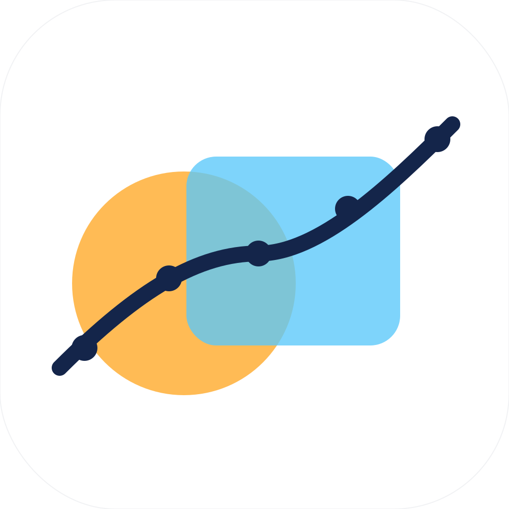

<div align="center">
  

  <h1>Hypratia — LLMチャットを"第二の脳"にする、オープンソースのAIワークスペース</h1>

  <p>
    <b>ローカルファースト / Macネイティブ / Bring-your-own-key（BYOK）</b><br/>
    ChatGPT・Claude・Gemini・Mistralとの会話を、検索・整理・書き出しできる知識ベースに変える、無限キャンバス型のAI仕事効率化ツール。データはすべてプレーンなMarkdownで自分のMacに保存されます。
  </p>

  <p>
    <a href="LICENSE"></a>
    <a href="COMMERCIAL-LICENSE.md"></a>
    
    
    
    
    
  </p>

  <p>
    <a href="README.md">English</a> · <b>日本語</b>
  </p>
</div>

---

## Hypratiaとは

**Hypratia（ヒュプラティア）**は、LLMとの会話を中心に仕事をしている人のための、**オープンソース・ローカルファーストのAIワークスペース**です。右ペインは普通のストリーミングチャット、左ペインは無限キャンバス。チャットのメッセージも、PDFの引用も、デイリーノートも、すべてドラッグ可能なMarkdownノードとしてキャンバスに落として、並べ替え、つなぎ、要約し、書き出せます。

**「AIと話せるセカンドブレイン」**だと考えてください。会話を**捕まえ**、答えを**蒸留**し、関連するアイデアの隣に**配置**し、まるごとMarkdownとして自分のObsidian Vaultに**書き出す**。クラウド同期なし、テレメトリなし。鍵もファイルもマシンも、すべてあなたのもの。

> Capture（捕まえる）→ Distill（蒸留する）→ Map（配置する）→ Export（書き出す）。

## なぜHypratiaか

こんな悩みに刺さるはずです。

- **「ChatGPTの履歴が墓場になっている」** — スレッドは流れ、せっかくの良い答えは消え、3週間前のあのプロンプトはもう見つからない。
- **「Claude ProjectsもNotion AIも便利だけど、データは他社のサーバーにある」** — ローカルで完結し、プレーンファイルで持ち、ベンダーロックインなしで使いたい。
- **「OpenAI、Anthropic、Gemini、Mistral、Groq、ローカルOllamaを、ひとつのキーボード操作中心UIで使いたい」**
- **「最初からObsidian互換のAIワークスペースが欲しい」** — Wikilink、frontmatter、デイリーノート、Vault規約、全部そのまま。
- **「チャットボットじゃなくて、思考の場が欲しい」** — 空間配置、無限キャンバス、チャットからキャンバスへのドラッグ、ノード接続、トランスクルージョン、要約。

Hypratiaは、**ChatGPT Canvas / Claude Projects / Notion AI / 各種クローズドソースのAIデスクトップアプリの、ローカルファースト代替**として位置付けられています。Obsidianヘビーユーザーのファイル形式・UX期待値に最初から合わせています。

## 機能

### マルチプロバイダー対応のAIチャット
- OpenAI（GPT-5/4o/4.1）、Anthropic（Claude Sonnet/Opus/Haiku）、Google Gemini、Mistral、Groq、任意の**OpenAI互換エンドポイント**、ローカルの**Ollama**——すべてVercel AI SDKの単一境界の裏側で**ストリーミング**動作。
- **BYOK（Bring-your-own-key）**：APIキーは自分のMacにだけ、FileVaultで保護されたapp data配下に保存されます。Hypratiaのサーバーは**存在しません**。
- **会話単位のモデル切り替え**、トークン使用量の集計、ライブのコストメーター。
- **再生成**、**送信停止**、**Search / Deep Researchモードの明示UI**——プロバイダー未接続のときに「ブラウズしたフリ」をしません。

### 思考のための空間キャンバス
- `@xyflow/react`による**無限キャンバス**、4方向ハンドル、矩形選択、フィットズーム。
- **チャットの任意のメッセージをキャンバスへドラッグ**して、編集・リンク・再プロンプトできるMarkdownノードに変換。
- **選択時のAIパレット（`Cmd+J`）**：Improve / Summarize / Expand / Extract / Question / カスタムプロンプト——結果は新しいリンク済みノードに。
- **PDF・画像・ドキュメントノード**：PDFをドロップ→ビューア内のテキストを選択→ワンクリックで`pdfRef` frontmatter付きの引用カードと、元ページへのバックエッジが生成されます。
- **Wikilink `[[id|alias]]`** と**トランスクルージョン `![[id]]`**（循環検出付き）。
- 全ノードに**自由編集可能なYAML frontmatter**。

### 自分のスタイルで作る知識ベース
- **プロジェクトごとの知識フォルダ**（`raw/` / `instruction/` / `processed/`）で、原本PDFとAIへの指示と長期記憶と機械生成インデックスをきれいに分離。
- **デイリーノート（`Cmd+D`）**、**Inboxクイックキャプチャ（`Cmd+Shift+Space`）**、**テンプレート変数**（`{{date}}`、`{{title}}` ほか）。
- **コマンドパレット（`Cmd+P`）**、**検索（`Cmd+K`）**、**チートシート（`Cmd+?`）**——全アクションがキーボード到達可能。

### Obsidian互換エクスポート
- ショートカット一発（`Cmd+Shift+E`）で、現在のワークスペースをObsidian Vaultがそのまま読めるフォルダ構成として書き出し：`LLM-Conversations/`, `LLM-Daily/`, `LLM-Nodes/`, `LLM-Maps/`, `LLM-Attachments/`。
- 会話もノードも**YAML frontmatter付きのプレーンMarkdown**で出力。独自DBなし、移行コストなし。
- **アトミック書き込み**（tmpファイル + rename、300msデバウンス）で、保存中断時もVaultが壊れません。

### 設計レベルでのプライバシー
- **テレメトリゼロ**。アナリティクスゼロ。「匿名」ピングもゼロ。
- 通信は (1) あなたが設定したAIプロバイダーへのリクエストと、(2) 自動アップデーター有効時のGitHub Releaseチェック、これだけ。
- **AGPLv3でソース公開**。全行を監査でき、フォークでき、自前ホストできます。

## クイックスタート

```bash
git clone https://github.com/TenCent46/hypratia.git
cd hypratia
pnpm install
pnpm tauri dev
```

アプリが起動したら：

1. **Settings → Providers** を開く。
2. OpenAI / Anthropic / Google / Mistral / Groq / OpenAI互換エンドポイント / ローカルOllamaのいずれかにAPIキー（またはURL）を設定。
3. **Test** で接続確認。
4. `Cmd+N` で新規会話、`Cmd+Enter` で送信。

### macOS用のDMGをビルド

```bash
pnpm tauri build                                   # 通常ビルド
pnpm tauri build --target aarch64-apple-darwin     # Apple Silicon専用
pnpm tauri build --target x86_64-apple-darwin      # Intel Mac専用
```

成果物は `src-tauri/target/release/bundle/dmg/`（明示ターゲット指定時はターゲット別パスの`bundle/dmg/`）に出力されます。

## 対応AIプロバイダー

| プロバイダー | ストリーミング | Tool calls | ローカル |
|---|---|---|---|
| OpenAI（GPTシリーズ） | ◯ | ◯ | × |
| Anthropic（Claudeシリーズ） | ◯ | ◯ | × |
| Google Gemini | ◯ | ◯ | × |
| Mistral | ◯ | ◯ | × |
| Groq | ◯ | ◯ | × |
| OpenAI互換エンドポイント全般 | ◯ | ◯ | 構成次第 |
| Ollama（ローカルモデル） | ◯ | △ | **◯** |

会話単位で混在使用OK——下書きはGroqの高速モデル、本格的な回答はClaude Opusで再走、といった使い分けができます。

## キーボードショートカット

| 操作 | ショートカット |
|---|---|
| コマンドパレット | `Cmd+P` |
| 検索 | `Cmd+K` |
| 選択中テキストのAIパレット | `Cmd+J` |
| 今日のデイリーノート | `Cmd+D` |
| クイックキャプチャ | `Cmd+Shift+Space` |
| 全ショートカット一覧 | `Cmd+?` |
| 設定 | `Cmd+,` |
| 新しい会話 | `Cmd+N` |
| 空ノードを追加 | `Cmd+E` |
| Current/Globalマップ切替 | `Cmd+G` |
| ビューポートをセンタリング | `Cmd+0` |
| Select / Handツール | `V` / `H` |
| Inspect/Chat切替 | `Cmd+Shift+I` |
| Vaultへエクスポート | `Cmd+Shift+E` |
| 送信 / 停止 | `Cmd+Enter` / `Cmd+Backspace` |

## ユースケース

- **リサーチアシスタント** — `raw/` にPDFを束で投げ込み、ClaudeやGPTに要約させ、引用クリックで該当ページへ瞬時に戻る。
- **長文ライティング** — キャンバスでアウトラインを組み、チャットで草稿を書き、よかった段落だけノードに蒸留して、最後にObsidianへエクスポート。
- **コードベースの相棒** — エラーログを貼って解説させ、定番の修正をリンクされたノードとして保存。次に同じことが起きたら、まず自分のVaultをgrepする。
- **学習・勉強** — デイリーノート＋AI生成のフラッシュカード＋元PDF、ぜんぶ同じ無限キャンバスに。
- **議事録と意思決定ログ** — 文字起こしを取り込み、アクションアイテムを蒸留し、プロジェクト知識ベースの隣にマップを書き出す。
- **セカンドブレイン** — 何年分ものLLM会話を、スクロールロックされたチャット履歴ではなく、**オフラインで検索可能なナレッジグラフ**として持つ。

## 技術スタック

- **シェル**：[Tauri 2](https://tauri.app/)（ネイティブWebView、極小Rustコア、Electronなし）。
- **UI**：React 19 + TypeScript 5 + Vite 7。
- **キャンバス**：[`@xyflow/react`](https://reactflow.dev/)（React Flow）。
- **状態管理**：[Zustand](https://github.com/pmndrs/zustand)。
- **Markdown**：`react-markdown` + `remark-gfm` + `remark-math` + `rehype-katex` + `rehype-highlight`。数式はKaTeX、コードはhighlight.js。
- **AIゲートウェイ**：[Vercel AI SDK](https://sdk.vercel.ai/) で OpenAI / Anthropic / Google / Mistral / Groq / OpenAI互換 / Ollama をラップ。
- **PDF**：`react-pdf` + `pdfjs-dist`、テキストレイヤー選択対応。
- **エディタ**：CodeMirror 6（Markdown対応）。
- **コマンドパレット**：[`cmdk`](https://cmdk.paco.me/)。
- **永続化**：Tauri `appDataDir()` 配下のエンティティ単位JSONファイル（アトミック書き込み）。

## プロジェクト知識フォルダの構成

```text
knowledge-base/
  projects/
    [project-name]/
      raw/           # 原本（PDF、DOCX、Markdown、txt、csv等）
      instruction/
        instruction.md       # このプロジェクト固有のAI指示
        memory.md            # 決定事項・ユーザー設定・長期記憶
        meta-instruction.md  # 検索・citation利用の短いルール
      processed/     # 抽出テキスト・チャンク・インデックス（機械生成）
```

原本は `raw/`、AIへの指示は `instruction/`、機械生成のインデックスは `processed/`——`memory.md` にPDF本文や長い要約を詰め込まないこと。

## ローカルデータの保存場所

アプリの永続データはTauriの `appDataDir()` 配下に保存されます（macOSではおおむね `~/Library/Application Support/com.bakerization.memory-canvas/`）。

- `conversations.json`、`messages.json`、`nodes.json`、`edges.json`
- `settings.json`、`attachments.json`、`secrets.json`
- `attachments/YYYY-MM/<id>.<ext>`
- `LLM-Conversations/`、`LLM-Daily/`、`LLM-Nodes/`、`LLM-Maps/`、`LLM-Attachments/`

## 開発コマンド

```bash
pnpm install                # 依存関係のインストール
pnpm tauri dev              # Tauriデスクトップ開発起動
pnpm dev                    # Viteのみ（ブラウザ開発、機能制限あり）
pnpm build                  # tsc + Vite production build
pnpm typecheck              # TypeScript型チェック
pnpm lint                   # ESLint
pnpm check:knowledge        # 知識リトリーバルのスモークチェック
pnpm tauri build            # macOS .app + .dmg 作成
```

設計ルール（サービス境界、アトミック書き込み、Markdownレンダリング面の単一化など）はすべて [CLAUDE.md](CLAUDE.md) にまとまっています。

## ロードマップ

現在 **v1.1.0-beta.1**。次に予定されているもの：

- `tauri-plugin-keyring` 経由のOSキーチェーン格納（現在はFileVault保護のapp data平文）。
- OSレベルのグローバルクイックキャプチャ（アプリ内 `Cmd+Shift+Space` は既に動作）。
- 自動アップデーター（設定はscaffold済、現在は無効）。
- CIでのApple Developer署名。
- Windowsビルドの整備。
- Webビルド（ストレージアダプタ1ファイルの差し替えで実現）。
- オプトイン式の **L2 / L3** AI要約レイヤー。

実装済み内容は [CHANGELOG.md](CHANGELOG.md)、長期計画は [plan/](plan/README.md) を参照してください。

## コントリビュート

PR歓迎です。出す前に：

1. [CLAUDE.md](CLAUDE.md) を読んでください——HypratiaをWindowsとWebに移植可能に保つための**サービス境界**が明文化されています（`@tauri-apps/*` をimportできるのは `services/storage|export|dialog|secrets|attachments|llm|shortcut/` のみ）。
2. `pnpm typecheck && pnpm lint` がクリーンであること。
3. ストレージに触る新機能は、必ずアトミック書き込みパスとエンティティ単位のJSONファイルを使うこと（モノリシックBLOB禁止）。
4. エクスポート処理をコンポーネントに置かないこと——ユーザーのVaultにMarkdownが書かれた瞬間、そのフォーマットは契約になります。

バグ報告・機能リクエストは [GitHub Issues](https://github.com/TenCent46/hypratia/issues) へ。

## プライバシー

- **テレメトリは一切ありません**。
- 外向き通信は、あなたが設定したAIプロバイダーへのリクエストと、アップデーター有効時のGitHub Releaseチェックのみ。
- APIキーはすべてローカル保存。v1.0-betaではFileVault保護のapp data配下平文ファイル、v1.0 finalでOSキーチェーンに切り替わります。

## ライセンス

Hypratia Coreは **[GNU AGPLv3](LICENSE)** で公開されています。

ただし、**Hypratiaの名称・ロゴ・ブランド、Webサイト、デザイン素材、公式署名済みビルド、商用Pro / Enterprise拡張機能はAGPLv3の対象外**で、Hypratiaプロジェクトに留保されます。AGPLv3下でHypratia Coreをフォークする場合は、別の名前・ブランドを使ってください。

クローズドソース製品への組み込み、ネットワークサービスとしてのAGPLv3 §13回避、サポート契約、Enterprise導入には**Commercial License**が用意されています。詳細は [COMMERCIAL-LICENSE.md](COMMERCIAL-LICENSE.md) を参照してください。

## クレジット

Hypratiaは [Tauri](https://tauri.app/)、[React](https://react.dev/)、[React Flow](https://reactflow.dev/)、[Vercel AI SDK](https://sdk.vercel.ai/)、[Obsidian](https://obsidian.md/)（Markdown Vault規約の事実標準を作ってくれたことに感謝）、そしてローカルファーストソフトウェアコミュニティの先行作の上に立っています。

---

<sub>
キーワード：オープンソース AI ワークスペース、ローカルファースト LLM アプリ、ChatGPT 代替、Claude Projects 代替、Notion AI 代替、Obsidian AI 連携、AI セカンドブレイン、無限キャンバス AI チャット、BYOK AI デスクトップ、Mac AI 仕事効率化、マルチプロバイダー LLM クライアント、OpenAI Anthropic Gemini Mistral Groq Ollama、PDFチャット、ナレッジマネジメント、知識管理、思考整理、自前ホスト AI、AGPL AI アプリ、Tauri React TypeScript。
</sub>

<!--
推奨GitHub Topics（リポジトリページ右側の "About" に設定）：
ai, llm, openai, anthropic, claude, gemini, mistral, groq, ollama, chatgpt-alternative,
claude-projects-alternative, notion-ai-alternative, local-first, privacy, obsidian,
markdown, knowledge-management, second-brain, productivity, infinite-canvas,
react-flow, tauri, react, typescript, macos, desktop-app, byok, ai-workspace,
ai-chat, pdf-chat
-->
